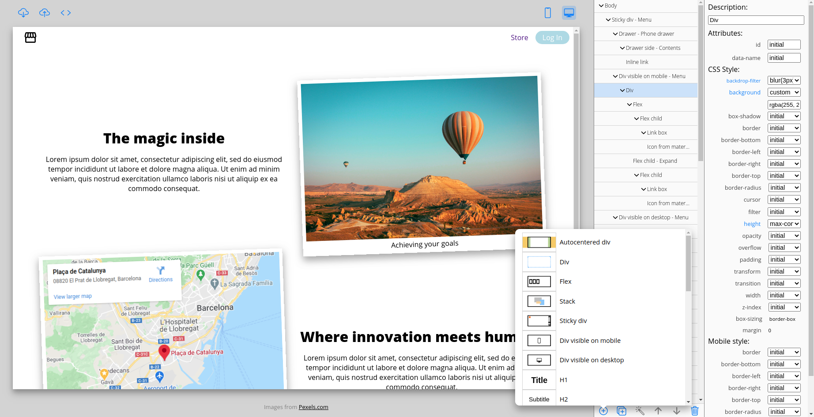
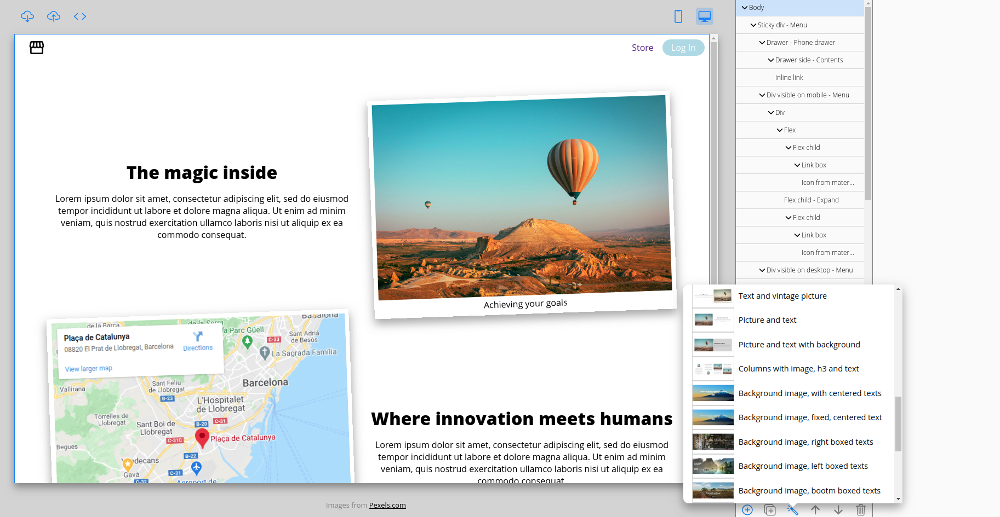

# Layouts-tool

Nodejs web tool for prototyping and templating HTML sites

### Install node dependencies

```
npm install
```

### Start server

```
npm start
```

### Run supervised server

Watch server for changes and restarts it if necessary

```
npm run supervisor
```

## Tool captures

Elements and configs



Templates



